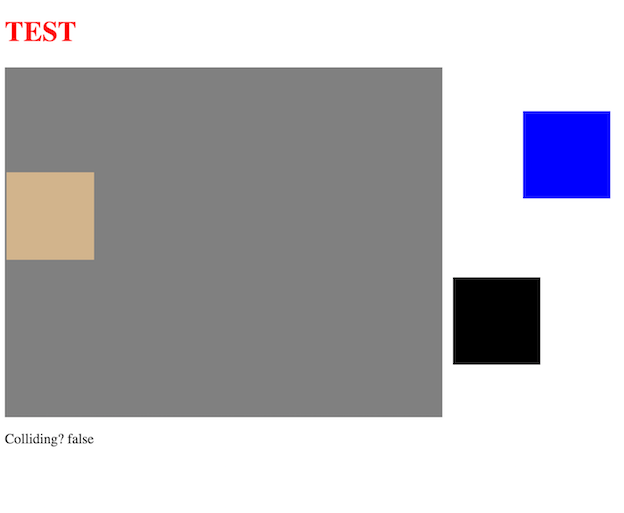

# BikeLondon
GA WDI Project One
Will Cook 2016

Play the game [here](https://willbikelondon.herokuapp.com/)

### Overview
This project was about bringing together the skills we had learnt in one individual project.

### Aim of the project
* **Include separate HTML / CSS / JavaScript files**
*  A **working game, built by me**, hosted somewhere on the internet
* A **link to my hosted working game** in the URL section of my Github repo.
 
### Technology Used
* Javascript
* jQuery
* HMTL5
* CSS3
* Heroku
* git

### Project Feedback + Evaluation
In only having had 2 weeks experience in the technology used it was a big learning curve. This project has taught me lots about how to tackle a web development project.

#### Steps I took:
- Planning, timeline, wireframes, developing gameplay rules, technology to use, code tests, functionality tests and uploading.
- Individually building and testing components. Collision tests, key press control, audio and restricting the movement of the player. Later implementing these into the main game file.
- Staring simple. Adding on game components one at a time. Keeping it simple as I worked towards an MVP. Here is a screenshot of early testing:
(Note, the simplification of cars and the bike to coloured boxes).  

### Challenges faced
- The need to respond to collisions. This meant a rebuild and adaptation of a similar collision management script. Challenges faced involved the thorugh understanding of the code.
- The avoiding collision of the car elements. Getting the logic to work to get the cars to not drive on top of each other.
- Understanding enough jQuery and Javascript to get the job done.
- Getting css and html to show how I wanted. 

### Where to from here?
The game could be improved in the following ways:

* Convert the Javascript code over to Object-Orientated code.
* Get more code written in jQuery. There must be components of my code that can be written in simpler ways. 
* Adding on a second player either playing locally or via the internet.
* Adding on more challenges and levels.
* Making the levels harder through addons such as; potholes, pedestrians, rubbish,roadworks, corners in the road etc...
* Add speed via the peddling key presses(z,x keys).
* Add a route or destination the player has to go to.
* Timer or race against another player through the level.
* Intergration with music, eg intergrate spotify to keep players on the site longer
* Not just a top down view.

### Bugs/Issues
- Occassionally a double car will come through there must be a break in my anti-collision for the cars function.
